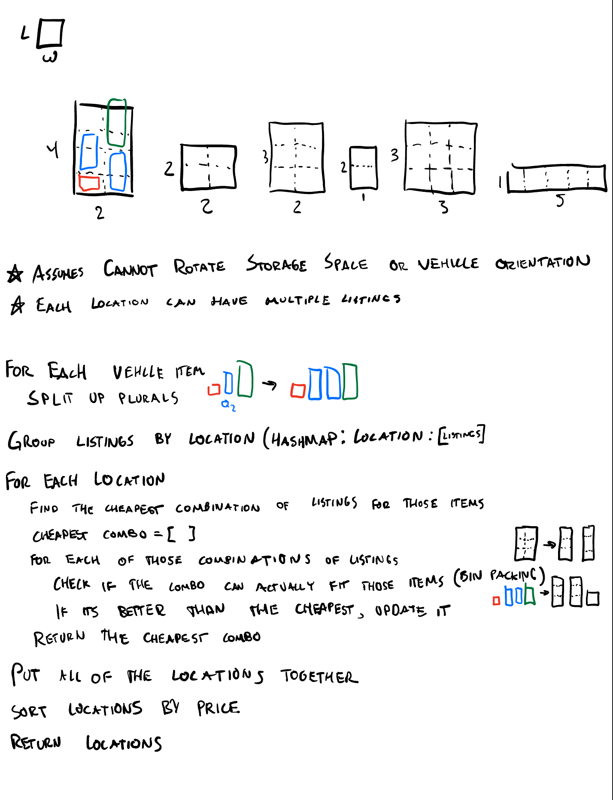

# Problem

Find available parking locations that fit multiple vehicles and return them sorted by price. Each listing provides parking "rows" (width/10) that act as bins for fitting vehicles along their length.

## Pseudocode


## Algorithms Tested

**First-Fit**: Place each item in first bin with space  
**Best-Fit**: Place each item in bin with tightest fit  
**Exact-Fit**: Prioritize exact matches, fall back to best-fit

All use decreasing order sort (largest items first).

Test the different algorithims by running `node test-algorithms.js`

Test the endpoint
```bash
curl -X POST "http://my-api-env.eba-tmfkskbp.us-east-1.elasticbeanstalk.com" \
   -H "Content-Type: application/json" \
   -d '[
            {
               "length": 10,
               "quantity": 1
            }
      ]'
```

## Test Results

365 locations tested across 3 scenarios:

```
📦 Small vehicles: [10, 10, 15]
   First-Fit  →  348 locations |  8.90ms
   Best-Fit   →  348 locations |  4.94ms
   Exact-Fit  →  348 locations |  3.94ms

📦 Mixed sizes: [10, 20, 20, 25]
   First-Fit  →  304 locations |  0.78ms
   Best-Fit   →  304 locations |  2.00ms
   Exact-Fit  →  304 locations |  3.53ms

📦 Large vehicles: [30, 30, 40, 40]
   First-Fit  →  185 locations |  0.95ms
   Best-Fit   →  185 locations |  2.37ms
   Exact-Fit  →  185 locations |  1.13ms
```

## Key Discoveries

1. **All algorithms found identical solutions** - No advantage to complexity
2. **Performance differences are negligible** - All < 10ms for full dataset
3. **First-Fit generally fastest** - Early termination benefit
4. **Exact-Fit chosen as default** - Future-proof, minimal overhead

## Assumptions

- **Brute force subset search** (2^n): Most locations have < 10 listings, guarantees optimal price
- **Pre-sorting items**: Standard bin packing best practice

## Findings

- Surprisingly, going from first-fit to best-fit to exact-fit didn't make any difference in finding the least listings used for each locations, due to most locations having < 10 listings. If, say all of the listings were contained in 10 or so locations, the algorithm used may make a difference.
- Using different algorithms didn't make a huge difference in timing, either. In some cases, using the exact fit elimated some computation time due to finding exact matches.

## Conclusion

All three algorithms are production-ready with equivalent performance. Simple approaches work best for this dataset. Total processing: < 10ms across 365 locations.

## Feedback / Wrap up

- At first, it took me a while to realize that `locations` and `listings` were not the same thing. I assumed that `listings.json` contained all unique objects. As I got into writing code, I quickly realized I was missing something so I went back to read the instructions again and fixed my mistake. This made figuring out the algorithm loads easier because insted of iterating over the entire list of `location` objects with the bin packing algorithm, it was cut down to performing the operation on each `location's` `listings`. Even though I Bin Packing is an NP-hard problem, when the algorithm is run on a bunch of small subsets it becomes blazing fast even with the exact-fit.
- I had a hiccup when I realized that using python with Node express made everything unnecessarily a little more complicated, so fixing that mistake cost me a little extra time.
- At one point when researching the problem I found that you could use bitshifting for making the different listings combinations. I'd never practically used bitshifting, so I thought that was a cool to be able to implement.
- Overall it was a super fun problem to solve, it really got me thinking at some points. I looked into how the algorithm would change if the vehicles were able to rotate 90 degrees, and it would become significatly harder. Instead of treating each listing as rows of 1D bins, you'd need to pack 2d rectangles onto 2d parking spaces, checking both orientations for each vehicle. I found some algorithms that are for situations like this like the Shelf Packing or Bottom-Left Heuristics, which would be fun to implement. 
